# 🏗️ Architecture Overview

This document explains the system design, component interactions, and data flows of the WebRTC Voice Streaming solution.

---

## High-Level Architecture


---

## Component Deep Dive

### 1. Nginx Reverse Proxy (`nginx.conf`)

**Role**: SSL termination, request routing, WebSocket upgrade handling

**Key Configuration**:

```nginx
location /api/voice-streaming/ {
    proxy_pass http://voice_streaming/;  # Routes to port 8080
    proxy_http_version 1.1;
    proxy_set_header Upgrade $http_upgrade;
    proxy_set_header Connection "upgrade";
}
```

**Why it exists**:

- WebRTC's `getUserMedia()` requires HTTPS context
- Single entry point (port 443) for all services
- Handles WebSocket upgrade for persistent connections

---

### 2. Home Assistant (`homeassistant` container)

**Role**: Core automation platform, hosts custom panels, serves static files

**Key Files**:
| File | Purpose |
|------|---------|
| `config/configuration.yaml` | Main HA config, defines custom panels |
| `config/www/*.js` | Frontend JavaScript cards (served at `/local/`) |
| `config/custom_components/voice_streaming/` | HA integration component |

**Panel Registration** (`configuration.yaml`):

```yaml
panel_custom:
  - name: voice-sending-card
    sidebar_title: Voice Send
    sidebar_icon: mdi:microphone
    url_path: voice-streaming
    module_url: /local/voice-sending-card.js
```

---

### 3. WebRTC Backend (`voice-streaming` container)

**Role**: WebRTC signaling server and audio relay

**Core Class**: `VoiceStreamingServer` in `webrtc_server_relay.py`

**Key Responsibilities**:

1. **WebSocket Signaling**: Handles client connections at `/ws`
2. **Sender Management**: Receives audio tracks, stores them for relay
3. **Receiver Management**: Creates offers, sends audio tracks to receivers
4. **ICE Candidate Exchange**: Facilitates peer connection establishment

**Data Structures**:

```python
self.connections: Dict[str, dict] = {}
# { connection_id: { ws, pc, role, stream_id } }

self.active_streams: Dict[str, Dict] = {}
# { stream_id: { track, receivers[], sender_id } }
```

---

### 4. Frontend Cards (`config/www/`)

**Role**: User interface for sending/receiving voice

**Files**:
| File | Purpose |
|------|---------|
| `voice-sending-card.js` | Capture & send microphone audio |
| `voice-receiving-card.js` | Receive & play audio streams |
| `voice-streaming-card-relay.js` | Combined send/receive (alternative) |

**Component Pattern**: Vanilla Web Components with Shadow DOM

```javascript
class VoiceSendingCard extends HTMLElement {
  constructor() {
    super();
    this.attachShadow({ mode: "open" });
    // ...
  }
}
customElements.define("voice-sending-card", VoiceSendingCard);
```

---

## Data Flow Diagrams

### Sending Voice Stream


### Receiving Voice Stream

```mermaid
sequenceDiagram
    participant R as Browser (Receiver)
    participant N as Nginx
    participant V as Voice Streaming Server

    R->>N: WebSocket Connect
    N->>V: WebSocket Connect
    V->>R: { type: 'available_streams', streams: ['stream_xyz'] }

    R->>V: { type: 'start_receiving', stream_id: 'stream_xyz' }
    V->>V: Get track from active_streams
    V->>V: Create RTCPeerConnection
    V->>V: addTrack(sourceTrack)
    V->>V: createOffer()
    V->>R: { type: 'webrtc_offer', offer: {...} }

    R->>R: setRemoteDescription(offer)
    R->>R: createAnswer()
    R->>V: { type: 'webrtc_answer', answer: {...} }

    R->>V: { type: 'ice_candidate', candidate: {...} }
    V->>R: ICE candidates exchange

    Note over R,V: ICE Connection Established

    V-->>R: Audio RTP Packets (via WebRTC)
    R->>R: ontrack → audio.srcObject = stream
    R->>R: audio.play()
```



---

## Network Topology


---

## WebRTC Configuration

### ICE Servers (STUN)

```json
{
  "iceServers": [{ "urls": "stun:stun.l.google.com:19302" }, { "urls": "stun:stun1.l.google.com:19302" }, { "urls": "stun:stun.stunprotocol.org:3478" }]
}
```

### RTC Configuration

```json
{
  "bundlePolicy": "max-bundle", // Multiplex all media on single transport
  "rtcpMuxPolicy": "require", // RTP and RTCP on same port
  "sdpSemantics": "unified-plan", // Modern SDP format
  "iceCandidatePoolSize": 10, // Pre-gather candidates
  "iceTransportPolicy": "all" // Allow all ICE candidates
}
```

### Audio Constraints

```json
{
  "echoCancellation": true,
  "noiseSuppression": true,
  "autoGainControl": true,
  "sampleRate": 16000,
  "channelCount": 1
}
```

---

## Port Reference

| Port | Protocol | Service         | Purpose                     |
| ---- | -------- | --------------- | --------------------------- |
| 80   | HTTP     | Nginx           | Redirect to HTTPS           |
| 443  | HTTPS    | Nginx           | Main entry point            |
| 8123 | HTTP     | Home Assistant  | HA web interface (internal) |
| 8080 | HTTP/WS  | Voice Streaming | WebRTC signaling (internal) |

---

## Key Design Decisions

| Decision                 | Rationale                                            |
| ------------------------ | ---------------------------------------------------- |
| Relay pattern (not P2P)  | Enables one-to-many broadcast, server-side recording |
| aiortc over browser P2P  | Server can process audio, better NAT traversal       |
| Web Components not React | HA compatibility, no build step required             |
| Nginx as proxy           | Required for HTTPS (WebRTC security requirement)     |
| WebSocket for signaling  | Real-time bidirectional messages                     |
| No TURN server           | Simplicity; works on same network only               |

---

## Extension Points

1. **Add TURN server**: For cross-network NAT traversal
2. **Audio processing**: Insert processing in `process_audio_stream()`
3. **HA events**: Fire events when voice detected via `hass.bus.async_fire()`
4. **Recording**: Enable `MediaRecorder` in backend (code exists but disabled)
5. **Multiple streams**: UI already supports stream selection

---

_Generated by Elite Staff Engineer Handover Protocol (ESEHP-ASKS v2.0)_
